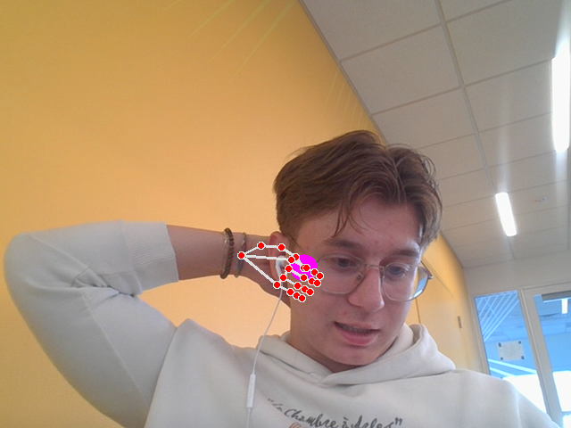
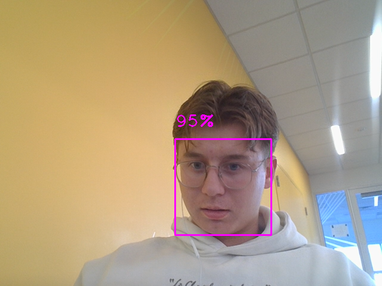
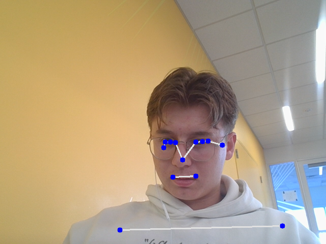
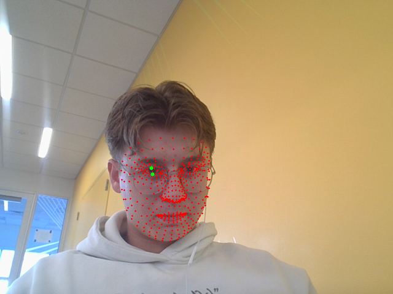

<div align="center">

<br/>

```
    ╔══════════════════════════════════════════════╗
    ║                                              ║
    ║   👁  RECOGNITION USING MEDIAPIPE  🤖        ║
    ║                                              ║
    ║   Hand · Face · Pose · Eye Mesh              ║
    ║                                              ║
    ╚══════════════════════════════════════════════╝
```

**Real-time computer vision demos powered by MediaPipe and OpenCV.**

Face detection, hand tracking, pose estimation, and eye/face mesh recognition — all running live from your webcam.

[](https://www.python.org/)
[](https://mediapipe.dev/)
[](https://opencv.org/)
[](LICENSE)
[](https://github.com/Davide-Bonn/Recognition-Using-Mediapipe/stargazers)

---

</div>

## Overview

Four standalone Python scripts that demonstrate core MediaPipe solutions using your webcam. Each script opens a live video feed, processes frames in real time, and draws the detected landmarks or bounding boxes directly on screen.

Press **`q`** to quit any script.

> **Looking for the eye-controlled mouse?** Check out [**MouseEye**](https://github.com/Davide-Bonn/MouseEye) — a separate project that lets you control your cursor with your eyes and click by blinking.

---

## Screenshots

<div align="center">

### Hand Tracking


21 landmarks per hand with connections and highlighted thumb tip.

### Face Detection


Bounding box with confidence percentage.

### Pose Estimation


33 body landmarks with full skeleton connections.

### Eye / Face Mesh Recognition


478-point face mesh with highlighted eye landmarks.

</div>

---

## Scripts

| Script | What it does |
|--------|-------------|
| **`Handtracking.py`** | Detects hands and draws 21 landmarks per hand with connections. Highlights the thumb tip (landmark 4) with a larger circle. Displays FPS |
| **`Facedetection.py`** | Detects faces and draws bounding boxes with confidence percentages. Displays FPS |
| **`Posetracking.py`** | Detects 33 body pose landmarks and draws the full skeleton with connections. Displays FPS |
| **`EyeRecognition.py`** | Draws all 478 face mesh landmarks and highlights key eye landmarks (145, 159) for left eye tracking |

---

## How It Works

Each script follows the same pipeline:

```
┌──────────┐    ┌──────────┐    ┌───────────┐    ┌──────────┐    ┌─────────┐
│  Webcam  │ ─► │ BGR→RGB  │ ─► │ MediaPipe │ ─► │   Draw   │ ─► │ Display │
│  Frame   │    │ Convert  │    │  Process  │    │ Landmarks│    │  imshow │
└──────────┘    └──────────┘    └───────────┘    └──────────┘    └─────────┘
```

1. **Capture** — OpenCV reads frames from the default webcam (`VideoCapture(0)`)
2. **Convert** — Frames are converted from BGR to RGB (MediaPipe expects RGB input)
3. **Process** — The relevant MediaPipe solution analyzes the frame and returns landmarks
4. **Draw** — Landmarks, bounding boxes, or connections are drawn onto the original frame
5. **Display** — The annotated frame is shown in an OpenCV window

---

## MediaPipe Solutions Used

| Solution | Script | Landmarks | Description |
|----------|--------|-----------|-------------|
| **Hands** | `Handtracking.py` | 21 per hand | Detects hand skeleton — fingertips, knuckles, wrist |
| **Face Detection** | `Facedetection.py` | 6 keypoints | Lightweight face bounding box with confidence score |
| **Face Mesh** | `EyeRecognition.py` | 478 | Dense face mesh with refined iris landmarks |
| **Pose** | `Posetracking.py` | 33 | Full body skeleton — shoulders, elbows, hips, knees, ankles |

---

## Quick Start

### Prerequisites

- [Python](https://www.python.org/) 3.8+
- A webcam

### 1. Clone and install

```bash
git clone https://github.com/Davide-Bonn/Recognition-Using-Mediapipe.git
cd Recognition-Using-Mediapipe
pip install -r requirements.txt
```

### 2. Run any script

```bash
python Handtracking.py
python Facedetection.py
python Posetracking.py
python EyeRecognition.py
```

Press **`q`** to close the window.

---

## Dependencies

| Package | Purpose |
|---------|---------|
| `mediapipe` | ML models for hand, face, pose, and mesh detection |
| `opencv-contrib-python` | Webcam capture, image processing, and display |
| `pyautogui` | Screen resolution detection (used in `EyeRecognition.py`) |

---

## Project Structure

```
Recognition-Using-Mediapipe/
├── assets/
│   ├── handtracking.png   # Screenshot — hand landmarks
│   ├── facedetection.png  # Screenshot — face bounding box
│   ├── posetracking.png   # Screenshot — pose skeleton
│   └── eyerecognition.png # Screenshot — face mesh
├── Handtracking.py        # Hand landmark detection (21 points per hand)
├── Facedetection.py       # Face bounding box detection with confidence
├── Posetracking.py        # Full body pose estimation (33 landmarks)
├── EyeRecognition.py      # Dense face mesh (478 points) with eye tracking
├── requirements.txt
├── LICENSE
└── README.md
```

---

## Related

| Project | Description |
|---------|-------------|
| [**MouseEye**](https://github.com/Davide-Bonn/MouseEye) | Eye-controlled mouse — move cursor with your iris, blink to click |

---

## License

[MIT License](LICENSE) — see LICENSE for details.
